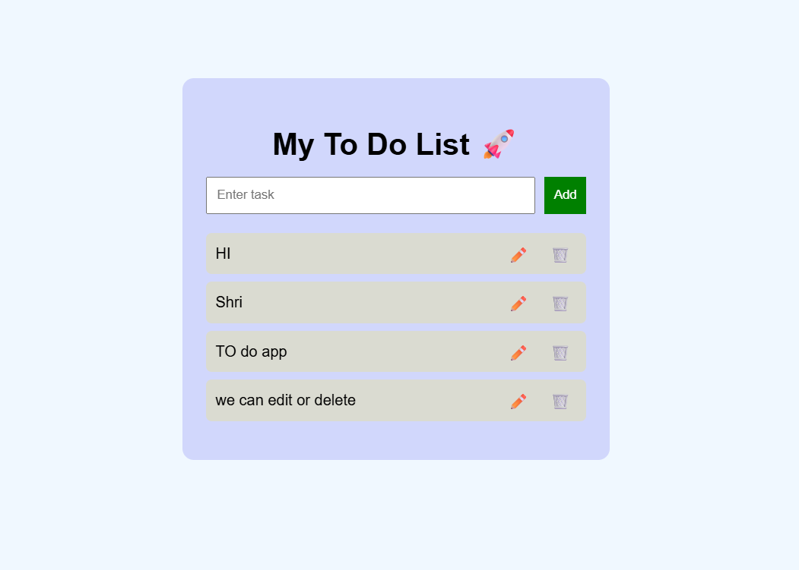

# 📝 To-Do List App

A simple and responsive To-Do List web application built using **HTML, CSS, and JavaScript**.

## 🚀 Features

* ➕ Add tasks
* ✏️ Edit tasks
* 🗑️ Delete tasks
* 💾 Data stored in LocalStorage
* 📱 Responsive design

## 🛠️ Technologies Used

* HTML
* CSS
* JavaScript

## 📸 Screenshots

(Add your project screenshot here)

## ▶️ How to Run

1. Download or clone this repository
2. Open `index.html` in your browser

## 📌 Future Improvements

* ✅ Mark tasks as completed
* 🌙 Dark mode
* 📊 Task counter

## 🙌 Author

* Shri

